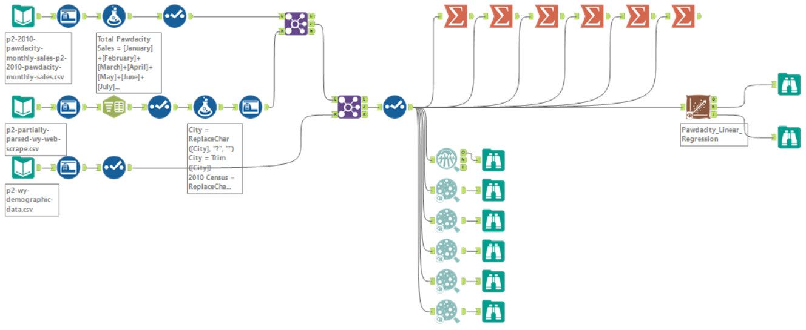
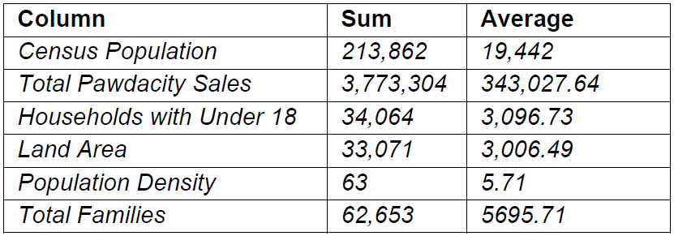
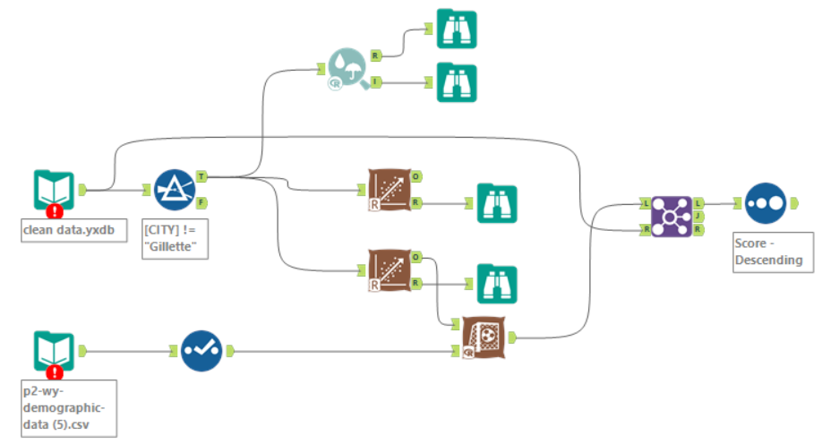
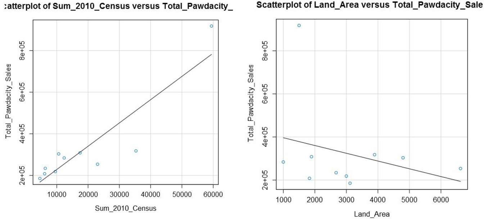
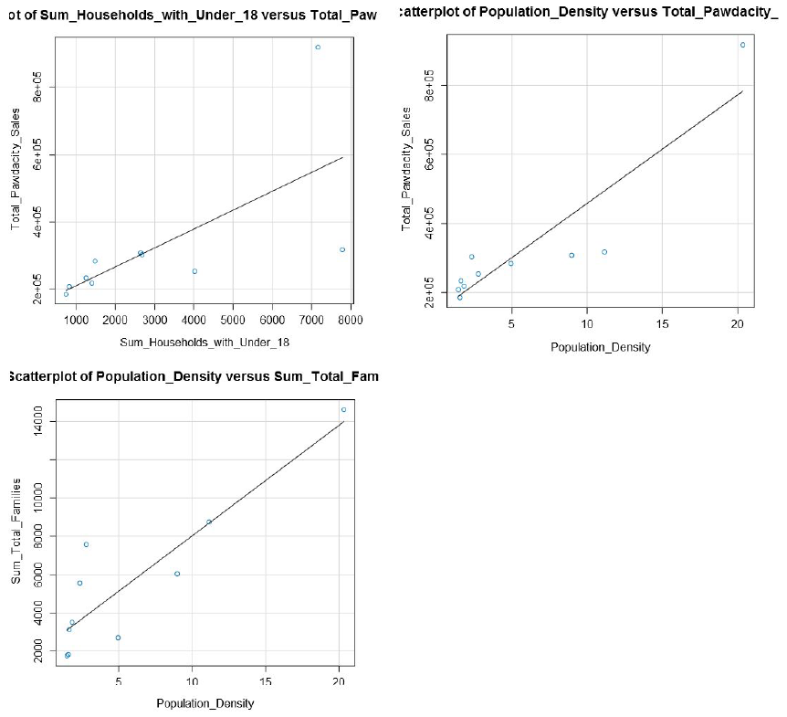
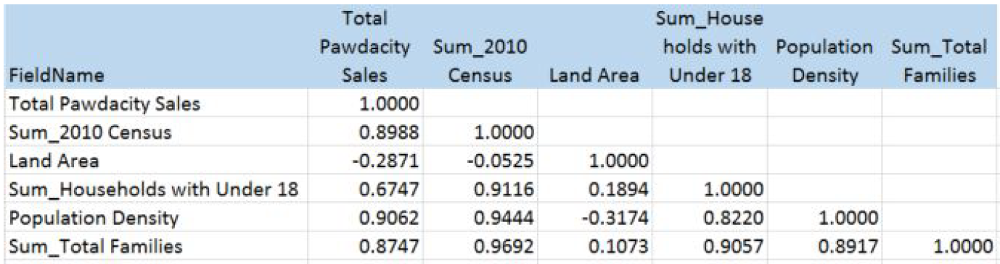
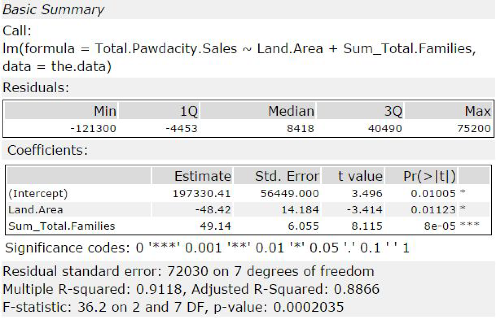

# Data-Wrangling-City-Recommendation-in-Alteryx

## P 2.1: Data Cleaning

### Step 1: Business and Data Understanding

#### What decisions needs to be made?
Final location (a city) has to be decided and selected for an opening of the new store. For predicting the city and get the best possible forecasting from the model we first need to eliminate the outlier cities and remove or impute them to justify within the model.
#### What data is needed to inform those decisions?
Since our job is to predict the city for the 14th store opening of and that was based on the total annual sales of the previous 13 stores. So, we needed yearly sales data for 13 stores and their other related information e.g. cities, population of the city etc.

### Step 2: Building the Training Set

### Step 3: Dealing with Outliers

Are there any cities that are outliers in the training set? Which outlier have you chosen to remove or impute? Because this dataset is a small data set (11 cities), you should only remove or impute one outlier. Please explain your reasoning.

Yes, we found outlier cities “Cheyenne” and “Gillette” in the training dataset based on the IQR analysis and decided to remove the city “Gillette” because it has lower 2010 census population, pawdacity sale, population density, and total families than another outlier city that may have played a vital role in the sale.

## P 2.2: Recommend a City

### Step 1: Linear Regression

#### 1. How and why did you select the predictor variables in your model? You must show that each predictor variable has a linear relationship with your
target variable with a scatterplot.

I first plotted each predictor variable against my target variable:

I can conclude all predictor variables are good potential predictor variables because they show a linear relationship between sales.

I checked for correlations between my predictor variables to see if there is any possibility of multicollinearity in my dataset. Below is a table that shows the correlations between the different predictor variables:

We can see that HHU18, Census, Families, and PDensity (Population Density) have strong correlations which each other. Land area however, is not as highly correlated. So I started by using land area as one predictor and then tested the four variables that are correlated.

I’ve found out that using land area and total families as the predictor variables produced the best model.

#### 2. Explain why you believe your linear model is a good model. You must justify your reasoning using the statistical results that your regression model created. You must talk about the p-values and R-squared values that your model produced.

The p-values for land area and total families are both below 0.05 and the Multiple R-squared value is at .91 which is close to 1. This is model is a decent model.

#### 3. What is the best linear regression equation based on the available data? Each coefficient should have no more than 2 digits after the decimal (ex: 1.28)

Y = 197,330 – 48.42 * [Land Area] + 49.14 * [Total Families]

### Step 3: Analysis

#### 1. What kind of data cleaning and aggregation steps did you do?

I started with the Web Scraped Data from the Wyoming Wikipedia page, and used text to columns and select tools and the Data Cleansing to parse out the City, County, 2010 Census, and 2014 Estimate and remove all of the extra punctuation.

For the demographic data, I used the Auto-field tool to combine all of the numbers labeled as String fields.

Before each join, I summarized the amounts by city to ensure that there were no duplicate city names within the data.

For Pawdacity sales file, I transposed the data to get City, Month, and Amount, and then summarized by City to get the total amount for each city.

From there, I created my data set used to train my regression model.

Once the model was created, I applied the model to the cities that were not already in the Pawdacity Sales file by taking the left output from the join on the Pawdacity sales file.

I took the competitor data with an autofield tool and joined it, with a formula off of the left join to create a 0 in the Competitor Amount so I could union the cities that have no competitor back into the overall dataset. I don’t want to exclude cities where no competitors are present.

I then applied the filters laid out in the project plan to come up with my list of possible cities, and sorted on the expected revenue to bring the best choice to the top.

#### 2. What were the sales prediction steps did you do?

I filtered my cities according to the given the criteria in the project and calculated revenue off the population density information using my linear model.

#### 3. Which city would you recommend and why did you recommend this city?

I would recommend the city of Laramie with a predicted sales of $305,014.
